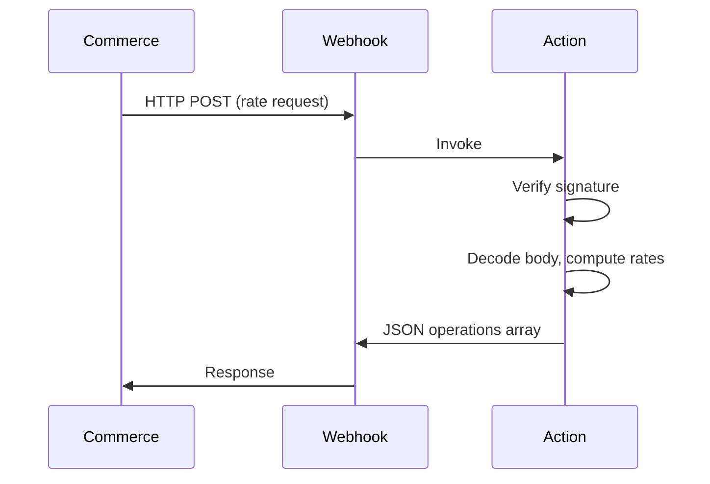

# Extension Architecture: Custom Shipping (Checkout Starter Kit)

<!--
  This document follows the ARCHITECTURE.md schema for the Checkout Starter Kit.
  Schema: references/architecture.schema.json
  All sections map to schema properties for consistent parsing by AI agents.
  Webhook Validation Table entries conform to references/webhook-validation.schema.json.
-->

## Contents

- Document Control — Environment — Webhook Validation Table (REQUIRED) — Component Architecture — Configuration Impact — Security Architecture — Data Flow — Decisions Log — Approvals

## Document Control

| Field | Value |
|-------|-------|
| **Extension Name** | Custom Shipping Rates |
| **Version** | 1.0 |
| **Status** | draft |
| **Last Updated** | YYYY-MM-DD |
| **Architect** | [Name] |
| **Requirements Source** | REQUIREMENTS.md v1.0 |

---

## Environment

| Aspect | Value |
|--------|-------|
| **Platform** | paas / saas / both |
| **Application Type** | Headless |
| **Runtime** | Node.js 22 |
| **Starter Kit** | Checkout Starter Kit |

---

## Webhook Validation Table (REQUIRED)

All REQUIRED fields must be verified with Adobe documentation before Phase 3 approval. Each row conforms to `references/webhook-validation.schema.json`.

| Target Domain | Action File | Webhook Method Name ⭐ | Webhook Type ⭐ | Response Format | Required | Logging Headers | Documentation Source ⭐ |
|---------------|-------------|------------------------|-----------------|-----------------|----------|------------------|--------------------------|
| shipping | actions/shipping-methods/index.js | [Full method from Adobe docs, e.g. plugin.out_of_process_shipping_methods.api.shipping_rate_repository.get_rates] | before / after | JSON operations array | Optional | x-ow-extra-logging: on | [Adobe documentation URL or MCP reference] |

### Webhook Configuration Summary

- **Webhook Method Name:** [from table] — Required for Commerce Admin.
- **Webhook Type:** [before/after] — [One sentence from documentation.]
- **Dual Security:** OAuth (`require-adobe-auth: true`) + signature verification (`COMMERCE_WEBHOOKS_PUBLIC_KEY`).

---

## Component Architecture

### Runtime Actions

| Action | Path | Purpose | Response Format |
|--------|------|---------|-----------------|
| shipping-methods | actions/shipping-methods/index.js | Calculate and return shipping rates | JSON operations array |

**Single-file pattern:** webhookVerify → decode body → business logic → return operations array.

---

## Configuration Impact

### Files to Create/Update

| File | Action | Details |
|------|--------|---------|
| app.config.yaml | Update | Add/update action definition, inputs, annotations |
| shipping-carriers.yaml | Update | Carrier definitions |
| .env | Update | COMMERCE_WEBHOOKS_PUBLIC_KEY, COMMERCE_BASE_URL, etc. (copy from env.dist; never commit .env) |

**Update order:** app.config.yaml → domain YAML → .env (copy from env.dist; never commit .env) → run onboarding script → action code.

---

## Security Architecture

- **Authentication:** require-adobe-auth: true for all webhook actions; IMS OAuth for SaaS.
- **Webhook validation:** Signature verification in code using COMMERCE_WEBHOOKS_PUBLIC_KEY.
- **Secrets:** $ENV_VAR in app.config.yaml; .env gitignored.

---

## Data Flow

Commerce sends a rate request via HTTP POST to the webhook; Runtime invokes the action; action verifies signature, decodes body, computes rates, returns JSON operations array; response returned to Commerce.

---

## Decisions Log

| ID | Decision | Rationale |
|----|----------|-----------|
| AD-1 | Use single-file action pattern for shipping-methods | Checkout Starter Kit uses one file per domain; no validator/transformer/sender pipeline. |

---

## Approvals

| Role | Name | Date |
|------|------|------|
| Architect | | |
| Technical Lead | | |
