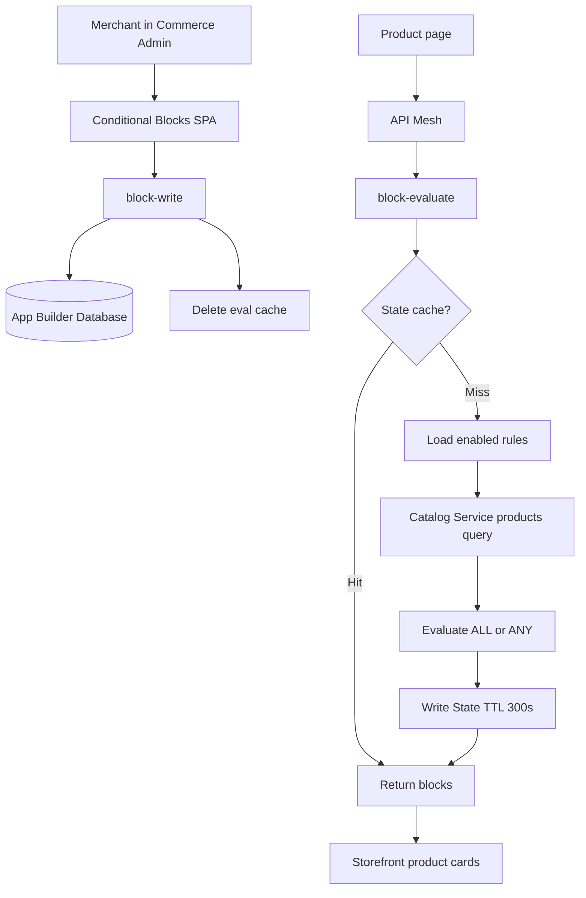
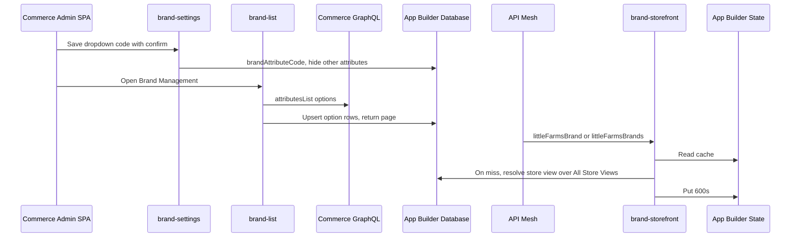

# Extension Architecture: LittleFarms Blocks Management

<!--
  This document follows the ARCHITECTURE.md schema.
  Schema: .cursor/references/architecture.schema.json
  All sections map to schema properties for consistent parsing by AI agents.
-->

## Document Control

| Field | Value |
|-------|-------|
| **Version** | 1.0 |
| **Status** | approved |
| **Last Updated** | 2026-09-28 |
| **Architect** | Solutions Architect Agent |
| **Requirements Source** | REQUIREMENTS.md v1.0 |
| **Approval Date** | 2026-09-28 |

---

## Environment

| Aspect | Value |
|--------|-------|
| **Platform** | saas |
| **Application Type** | spa |
| **Commerce Version** | Adobe Commerce as a Cloud Service |
| **Runtime** | Node.js 22 |

### Additional Constraints

- IMS OAuth 2.0 is mandatory. Admin users use the Authorization Grant through the Admin UI SDK session. Runtime actions that call Catalog Service use server-to-server credentials.
- App Builder project at repo root: package `littlefarms-appbuilder`, Admin UI in `src/commerce-backend-ui-2/web-src/`, actions under `actions/block/`. No PHP module.
- `scripts/onboarding/config/EVENTS_SCHEMA.json` is not in this workspace. Version 1 does not subscribe to Commerce events. Product freshness uses a short State TTL plus cache deletion on rule writes. See AD-2.
- Catalog reads use the ACCS Catalog Service `products(skus)` query, which returns `ProductView` data (`sku`, `attributes`, and related view fields). Price and category values are read from the fields that query exposes for this merchant. Condition evaluation fails closed when a required value is absent.
- Admin UI embedding uses Admin UI SDK `commerce/backend-ui/2` (`adminUi` in `app.commerce.config.ts`). Menu: **Content → Blocks Management**.

---

## Integration Points

### Commerce Events (Commerce → External)

Version 1 has no Commerce event subscription.

A product save does not push a webhook into this app. The evaluate cache expires after 300 seconds, and any admin rule write deletes cached evaluations immediately. That meets the “rule save visible within 60 seconds” criterion without depending on SaaS event-provider registration.

### Storefront request: evaluate

- **Trigger**: Commerce Storefront product page, or API Mesh on behalf of that page
- **Direction**: Storefront → App Builder → Catalog Service
- **Input**: `sku`, `storeViewCode`
- **Output**: `{ blocks: [...] }` as defined in REQUIREMENTS.md
- **Action Path**: `actions/block/storefront/evaluate/`

### Admin request: rule management

- **Trigger**: Merchant uses the Conditional Blocks page embedded in Commerce Admin
- **Direction**: Admin SPA → App Builder Database
- **Action Paths**:
  - `actions/block/admin/list/`
  - `actions/block/admin/write/`
  - `actions/block/admin/remove/`

### External System: Catalog Service

| Aspect | Value |
|--------|-------|
| **Type** | commerce-catalog |
| **API Type** | graphql |
| **Authentication** | IMS server-to-server |
| **Base URL** | `$COMMERCE_GRAPHQL_URL` |
| **Data Flow** | Read only. `products(skus: [$sku])` for the current product, and later the storefront’s own product-card query for target SKUs |
| **Rate Limits** | Cache hits do not call Catalog Service |

### External System: API Mesh

| Aspect | Value |
|--------|-------|
| **Type** | orchestration |
| **API Type** | graphql |
| **Authentication** | Mesh holds the evaluate action credential. Shopper browsers do not receive admin credentials |
| **Data Flow** | Storefront query `conditionalBlocks(sku, storeViewCode)` resolves to the evaluate action |
| **Rate Limits** | Same as the evaluate action |

The storefront may call the evaluate web action directly from its server runtime when API Mesh is not available yet. Both entry points share the same response contract. Browser code on the shopper page does not call admin actions.

---

## Component Architecture

### Runtime Actions

Every handler uses the six starter-kit files. Execution order is validate → transform → preProcess → send → postProcess.

#### Action: block-evaluate

- **Path**: `actions/block/storefront/evaluate/`
- **Files**: index.js, validator.js, pre.js, transformer.js, sender.js, post.js
- **Purpose**: Return the conditional blocks that match the product being viewed
- **Trigger**: HTTPS GET or POST from API Mesh or the storefront server
- **File Details**:
  - **validator.js**: Require `sku` and `storeViewCode`. Trim the SKU. Reject missing values. Verify the mesh or server credential. Reject admin mutation fields if present.
  - **transformer.js**: Build the cache key `eval:{storeViewCode}:{sku}` and a normalized request.
  - **pre.js**: Read App Builder State. When the key exists, set a short-circuit payload and skip Catalog Service.
  - **sender.js**: On a cache miss, load enabled rules from the database for `storeViewCode` and `*`, fetch the product from Catalog Service, and evaluate ALL / ANY rules.
  - **post.js**: On a miss, store the response in State with TTL 300 seconds. Return `{ blocks }` ordered by priority, then name.
- **Runtime Config**:
  - Runtime: `nodejs:22`
  - Web: `yes`
  - Timeout: `15000`
  - Memory: `256` MB
  - Annotations: `require-adobe-auth: false` is not used as an anonymous public API. The action checks `EVALUATE_SHARED_SECRET` (or the mesh IMS service token) inside validator.js. `final: true`.

#### Action: block-list

- **Path**: `actions/block/admin/list/`
- **Files**: index.js, validator.js, pre.js, transformer.js, sender.js, post.js
- **Purpose**: Return rules for the admin list and editor
- **Trigger**: Admin SPA, authenticated IMS user with the Conditional Blocks ACL
- **File Details**:
  - **validator.js**: Require Adobe IMS auth. Optional `storeViewCode` and `id` filters.
  - **transformer.js**: Normalize filters.
  - **pre.js**: No cache. Rules must be current for the editor.
  - **sender.js**: Query the `conditional_blocks` collection.
  - **post.js**: Return the list or a single rule. Omit nothing the editor needs to round-trip a save.
- **Runtime Config**:
  - Runtime: `nodejs:22`
  - Web: `yes`
  - Timeout: `10000`
  - Memory: `256` MB
  - Annotations: `require-adobe-auth: true`, `final: true`

#### Action: block-write

- **Path**: `actions/block/admin/write/`
- **Files**: index.js, validator.js, pre.js, transformer.js, sender.js, post.js
- **Purpose**: Create or update a rule, including enable and disable
- **Trigger**: Admin SPA save
- **File Details**:
  - **validator.js**: Require IMS auth and ACL. Validate FR-1 rules: name, aggregator, allowlisted attributes and operators, at least one condition, target SKUs or content, maximum 500 values on an `in` list.
  - **transformer.js**: Trim SKUs, coerce numeric values for numeric operators, set `updatedAt`.
  - **pre.js**: Reject a duplicate name in the same store view when the id differs.
  - **sender.js**: Insert or replace the rule document.
  - **post.js**: Delete State keys for that store view, or all `eval:*` keys when `storeViewCode` is `*`. Return the saved rule.
- **Runtime Config**:
  - Runtime: `nodejs:22`
  - Web: `yes`
  - Timeout: `10000`
  - Memory: `256` MB
  - Annotations: `require-adobe-auth: true`, `final: true`, `include-ims-credentials` for database access

#### Action: block-remove

- **Path**: `actions/block/admin/remove/`
- **Files**: index.js, validator.js, pre.js, transformer.js, sender.js, post.js
- **Purpose**: Delete a rule and clear its cached evaluations
- **Trigger**: Admin SPA delete
- **File Details**:
  - **validator.js**: Require IMS auth, ACL, and rule id.
  - **transformer.js**: Normalize the id.
  - **pre.js**: Load the rule so a missing id returns not found before delete.
  - **sender.js**: Delete the document.
  - **post.js**: Clear evaluation cache using the deleted rule’s store view. Return success.
- **Runtime Config**:
  - Runtime: `nodejs:22`
  - Web: `yes`
  - Timeout: `10000`
  - Memory: `256` MB
  - Annotations: `require-adobe-auth: true`, `final: true`

### Admin SPA

- **Path**: `web-src/`
- **Purpose**: Conditional Blocks list and editor, built with React Spectrum, embedded in Commerce Admin
- **Registration**: Admin UI SDK V2 menu in the app commerce config, label `Conditional Blocks`, ACL protected
- **Calls**: `block-list`, `block-write`, `block-remove` only

### Storefront block

Owned by the Commerce Storefront project, outside this repository.

- On the product page, call `conditionalBlocks(sku, storeViewCode)`.
- For each block, render `title`, sanitized `contentHtml`, and product cards for `targetSkus` in list order.
- Render nothing when `blocks` is empty or the request fails.

### State Management

| Key Pattern | Purpose | Storage | TTL |
|-------------|---------|---------|-----|
| `conditional_blocks` collection | Rule documents | database | Until deleted |
| `eval:{storeViewCode}:{sku}` | Evaluate response | state | 300 seconds |
| Catalog IMS token | Avoid a token exchange on every miss | state | 50 minutes |

### Scheduled Actions

None. Cache expiry and explicit deletion cover freshness.

---

## Configuration Impact

### Files to Create/Update

| File | Action | Details |
|------|--------|---------|
| `app.config.yaml` | Update | Replace `generic` with `block-evaluate`, `block-list`, `block-write`, and `block-remove`. Declare database `auto-provision: true`. Pass `$COMMERCE_GRAPHQL_URL`, IMS inputs, `$STATE_REGION`, `$DB_REGION`, `$EVALUATE_SHARED_SECRET` |
| `env.dist` | Update | Document the variables below. Do not commit real secrets |
| Admin UI SDK app commerce config | Create | `adminUi.menu` for Conditional Blocks with `aclProtected: true` |
| API Mesh config | Create | GraphQL field `conditionalBlocks` sourced from `block-evaluate` |
| `actions/generic/` | Remove during cleanup | Starter scaffold is unused |
| `commerce-event-subscribe.json` | No change | No event subscription in version 1 |

### Environment Variables

| Variable | Purpose | Example | Required |
|----------|---------|---------|----------|
| `COMMERCE_GRAPHQL_URL` | Catalog Service GraphQL endpoint | `https://catalog-service.adobe.io/graphql` | Yes |
| `IMS_ORG_ID` | IMS organization | org id | Yes |
| `IMS_CLIENT_ID` | Server-to-server client | client id | Yes |
| `IMS_CLIENT_SECRETS` | Server-to-server secret | secret | Yes |
| `IMS_SCOPES` | Catalog and App Builder scopes | scopes string | Yes |
| `EVALUATE_SHARED_SECRET` | Credential presented by API Mesh or the storefront server | random secret | Yes |
| `STATE_REGION` | State region | `amer` | Yes |
| `DB_REGION` | Database region | `amer` | Yes |
| `EVAL_CACHE_TTL` | Evaluation cache seconds | `300` | No |

### NPM Dependencies

| Package | Purpose | Version |
|---------|---------|---------|
| `@adobe/aio-sdk` | Logger and IMS auth client | Already declared |
| `@adobe/aio-lib-state` | Evaluation cache | Current 4.x |
| `@adobe/aio-lib-db` | Rule collection | Current library version |
| `@adobe/react-spectrum` | Admin editor | Already declared |

---

## Security Architecture

### Authentication

- **Admin SPA and admin actions**: IMS user token via Admin UI SDK. Actions set `require-adobe-auth: true`. The menu is `aclProtected: true`. Handlers call the Admin UI permission client before reading or writing rules.
- **Catalog Service**: IMS server-to-server token from the runtime action. Token cached in State.
- **Evaluate action**: Shared secret or mesh service credential checked in `validator.js`. A valid admin token is not accepted as permission to treat the request as a shopper call, and a shopper token cannot call write or remove.
- **Required credentials** (environment variables only):
  - `IMS_ORG_ID`
  - `IMS_CLIENT_ID`
  - `IMS_CLIENT_SECRETS`
  - `EVALUATE_SHARED_SECRET`

### Event Validation

- **Signature Verification**: Not applicable. Version 1 does not consume I/O Events.
- **Request validation**: Evaluate rejects missing SKU, missing store view, and a bad shared secret. Admin actions reject missing IMS auth.

### Secrets Management

- **Local development**: `.env`, copied from `env.dist`, gitignored
- **Production**: CI secrets injected at deploy. `app.config.yaml` references them as `$VAR` with `final: true`

### Data Protection

- Log rule id, SKU, store view, and match count.
- Do not log IMS tokens, the shared secret, or `contentHtml` bodies.
- Admin preview and the storefront sanitize `contentHtml` before display.
- Database and State are isolated to this App Builder workspace.

---

## Data Flow

### Description

A merchant saves a conditional block in the Admin SPA. `block-write` validates it, stores it in App Builder Database, and deletes cached evaluations. When a shopper opens a product page, the storefront asks API Mesh for `conditionalBlocks`. Mesh calls `block-evaluate`. On a cache hit the action returns the stored block list. On a miss it loads enabled rules, reads the current product from Catalog Service, evaluates ALL or ANY conditions, caches the result for 300 seconds, and returns matching blocks. The storefront renders product cards for `targetSkus`.

### Diagram



### Key Transformations

| From | To | Transformation |
|------|----|----------------|
| Catalog `sku` | Condition context `sku` | Trim |
| Catalog attributes `brand`, `amount`, attribute set | Condition context | First value for that attribute code. Missing attribute makes the condition false |
| Catalog final price | Condition context `price` | Numeric amount. This is PaaS “From Price” |
| Product category ids | Condition context `category` | Match if any product category id is in the rule list |
| Rule `aggregator = all` | Match boolean | Every condition true |
| Rule `aggregator = any` | Match boolean | At least one condition true |
| Matching rules | `blocks` | Sort by `priority` ascending, then `name` ascending. Drop disabled rules |

### Condition evaluation

```text
matchCondition(product, condition):
  actual = product[condition.attribute]
  if actual is missing: return false
  switch condition.operator:
    eq, neq, gt, gte, lt, lte: compare actual to condition.value
    in, nin: actual is in, or for category any id is in, the value list

matchRule(product, rule):
  if rule.aggregator == all: every condition matches
  if rule.aggregator == any: one condition matches
```

Numeric operators coerce both sides to numbers. If either side is not a number, the condition is false.

---

## Error Handling Strategy

### Retry Policy

- **Catalog Service**: 2 retries, exponential backoff, 200 ms then 400 ms, only for 429 and 5xx
- **Database on evaluate**: no retry loop beyond the driver default. Failure returns an empty `blocks` array
- **Admin writes**: no automatic retry. The merchant can save again. A failed write does not delete the previous document

### Failure Scenarios

| Scenario | Handling | Alerting |
|----------|----------|----------|
| Evaluate shared secret missing or wrong | 401, no catalog call | Log a security warning without the secret |
| SKU missing | 400 | Log validation error |
| Catalog timeout or 5xx after retries | 200 with `blocks: []` | Log error with SKU |
| Unknown product | 200 with `blocks: []` | Log info |
| Rule attribute missing on the product | Condition false | No alert |
| Database down during evaluate | 200 with `blocks: []` | Log error |
| Database down during save | 503, previous rule kept | Log error |
| Duplicate rule name | 400 with field error | No alert |
| `in` list longer than 500 | 400 | No alert |

### Idempotency Strategy

- Writes replace the rule document by id, so a repeated save of the same payload leaves one rule.
- Evaluate is a pure read. Concurrent cache misses may both call Catalog Service and both write the same State value.

---

## Performance Strategy

### Caching

| Data | Storage | TTL | Invalidation |
|------|---------|-----|--------------|
| Evaluate response | state | 300 seconds | Deleted on write and delete for that store view. Global delete when the rule store view is `*` |
| IMS catalog token | state | 50 minutes | Deleted on 401, then fetched again |

### Scaling Considerations

- Actions are stateless and scale with I/O Runtime.
- Catalog Service is called on cache misses only.
- Rule count for a store view is expected to stay in the low hundreds. The evaluate action loads enabled rules for one store view plus global rules, not the whole history of deleted rules.
- Target SKU hydration stays in the storefront so this action does not fan out one catalog call per recommended SKU.

---

## Testing Strategy Recommendations

### Unit Test Focus

- Evaluator: ALL sample (Antinori), ANY sample (SKU list), missing attribute, disabled rule, store view mismatch, priority order, numeric price equality
- `validator.js` on write: empty conditions, unknown operator, duplicate name, 501-value list
- Evaluate validator: missing SKU, bad shared secret
- Cache: hit skips the catalog client; write deletes keys

### Integration Test Scenarios

- Save Antinori rule, evaluate a matching product fixture, receive that block
- Evaluate a non-matching brand, receive an empty list
- Disable the rule, evaluate again, receive an empty list
- Catalog client throws, evaluate returns an empty list and does not throw

### Mock Requirements

- Catalog Service GraphQL client
- `@adobe/aio-lib-db`
- `@adobe/aio-lib-state`
- IMS token exchange

### Coverage Target

- 80% on `actions/block/**` evaluation, validation, and cache code

---

## Decisions Log

| ID | Decision | Rationale | Alternatives Considered |
|----|----------|-----------|------------------------|
| AD-1 | Custom rules service on App Builder | ACCS cannot run the LS Retail PHP module. Product Recommendations filters the recommendation result set. Live Search merchandising changes search and category ranking. Neither stores “if the current product matches these attributes, show these SKUs.” | Product Recommendations units. Live Search rules. In-process catalog widget |
| AD-2 | No Commerce event subscription in version 1 | The shopper path is a read. A 300 second TTL plus cache deletion on rule save meets the freshness target. `EVENTS_SCHEMA.json` is not in this workspace, and SaaS event registration is a separate onboarding step. | `catalog_product_save` event to bust cache per SKU. Polling the catalog |
| AD-3 | App Builder Database for rules, State for evaluations | Rules need query by store view and enabled flag and must persist. Evaluation results are small and expire. | State for rules (weak queries). Files for rules (no query) |
| AD-4 | Evaluate returns SKUs and content, and the storefront loads product cards | Keeps the action to one catalog read for the current product. Product card shape stays in the storefront drop-in. | Hydrate every target SKU inside the action |
| AD-5 | API Mesh is the storefront entry | One GraphQL field for the product page. The mesh holds the shared secret so the shopper browser never sees it. | Public anonymous web action. Admin token on the storefront |
| AD-6 | Admin UI SDK menu plus the existing `web-src` SPA | Merchants need to edit ALL / ANY rules in Commerce Admin. SaaS has no catalog-widget condition builder. The SPA is the supported out-of-process admin surface. | Recreating rules in code. A standalone App Builder URL outside Admin |
| AD-7 | Fail closed on missing attributes and catalog errors | A missing brand must not show the Antinori block. A catalog outage must not break the product page, so the action returns an empty list instead of an error page. | Fail open and show the block. Return 500 to the storefront |
| AD-8 | Flat ALL / ANY only | The supplied screenshots are a single aggregator with a flat condition list. Nested groups can be added later without changing the storage of a condition line. | Full Magento condition tree in version 1 |
| AD-9 | Drop Custom Layout Update | It is a Luma layout field, not a Catalog Service product attribute, so it cannot be evaluated on the ACCS storefront. | Exporting a dummy attribute merchants would have to maintain by hand |
| AD-10 | Six-file handlers for evaluate, list, write, and remove | Matches the Integration Starter Kit contract so validation, catalog access, and cache updates stay in separate files. | A single `actions/generic` router |

---

## Approvals

| Role | Name | Date |
|------|------|------|
| Architect | | |
| Technical Lead | User approval | 2026-09-28 |

---

## Change Log

| Version | Date | Author | Description |
|---------|------|--------|-------------|
| 1.0 | 2026-09-28 | Solutions Architect Agent | Initial architecture for the SaaS conditional block: admin SPA, database rules, catalog evaluation, State cache, storefront contract. |
| 1.0 | 2026-09-28 | Solutions Architect Agent | Approved for implementation by the user. |
| 1.1 | 2026-10-05 | Solutions Architect Agent | Brands module architecture draft. Blocks section above is unchanged. |
| 1.2 | 2026-10-05 | Solutions Architect Agent | Brands module architecture approved. |

---

## Brands module

<!--
  Phase 2 for the Brands module. Blocks architecture above stays as approved v1.0.
  Requirements: REQUIREMENTS.md v1.7, Brands module.
-->

### Document control

| Field | Value |
|-------|-------|
| **Version** | 0.2 |
| **Status** | approved |
| **Last Updated** | 2026-10-05 |
| **Architect** | Solutions Architect Agent |
| **Requirements Source** | REQUIREMENTS.md v1.7, Brands module |
| **Approval** | 2026-10-05 |

### Environment

| Aspect | Value |
|--------|-------|
| **Platform** | SaaS (ACCS) |
| **Application Type** | Admin UI SDK V2 SPA plus API Mesh |
| **Runtime** | Node.js 22 |
| **App** | Existing `littlefarms-appbuilder`. No second App Builder app |

IMS is mandatory. Admin actions that read or write the database set `include-ims-credentials: true`, same as Blocks.

### Webhook Validation Table

This module does not register a Commerce checkout webhook. Admin UI SDK V2 opens the existing app in an iframe. The storefront reads brands through API Mesh. There is no `before` or `after` webhook method to subscribe.

The checkout webhook schema (`references/webhook-validation.schema.json`) only allows payment, shipping, taxes, and events. Those domains do not apply here.

| Target domain | Action file | Webhook method name | Webhook type | Response format | Required | Logging | Documentation source |
|---------------|-------------|---------------------|--------------|-----------------|----------|---------|----------------------|
| Admin UI (not a checkout webhook) | None | Not applicable. No Commerce webhook method | Not applicable. Not `before` or `after` | Admin JSON for merchants. GraphQL for the storefront | Not applicable. No Commerce Admin webhook Required flag | `LOG_LEVEL` on the action. `x-ow-extra-logging` is a Commerce webhook header and is not used | [Admin UI SDK V2 menu](https://developer.adobe.com/commerce/extensibility/admin-ui-sdk/extension-points/v2/menu): one menu item per app; it opens the App Builder UI. [Programmatic mesh resolvers](https://developer.adobe.com/graphql-mesh-gateway/mesh/advanced/extend/resolvers/programmatic-resolvers): storefront queries |

#### Webhook configuration summary

- **Webhook method name:** none. [Menu docs](https://developer.adobe.com/commerce/extensibility/admin-ui-sdk/extension-points/v2/menu) describe an Admin iframe, not a webhook subscription.
- **Webhook type:** none.
- **Commerce Admin Required field:** not used. An empty brand lookup returns `null` (one brand) or `[]` (a list). The storefront renders no brand block. Checkout is unaffected.
- **Dual security for this module:**
  1. **Admin OAuth.** `require-adobe-auth: true` on `brand-settings`, `brand-list`, `brand-write`, and `brand-asset`. The Commerce Admin IMS session is who may call them. This matches the existing `block-list` annotation in `src/commerce-backend-ui-2/ext.config.yaml`.
  2. **Signature verification** (`COMMERCE_WEBHOOKS_PUBLIC_KEY`) does not apply. Commerce does not POST a signed webhook body to these actions.
  3. **Storefront.** API Mesh calls `brand-storefront`. The mesh holds the action URL in `api-mesh/secrets.yaml`. Shopper browsers do not receive admin IMS credentials. Brand content is public catalog data, same class as the public Blocks preset read. Inactive and hidden brands are omitted.

### Where it sits in the app

[V2 menu](https://developer.adobe.com/commerce/extensibility/admin-ui-sdk/extension-points/v2/menu) allows one `adminUi.menu` per app. Little Farms Admin already owns **Apps → Little Farms Admin**. Brands is a module on the existing rail in `src/commerce-backend-ui-2/web-src/src/modules/registry.ts`:

| Field | Value |
|-------|-------|
| id | `brands-management` |
| menuLabel | Brands |
| available | `true` when the module ships |

No new `parentMenu`. No second Commerce app.

### Component architecture

Single-file actions (`index.js`), plus `actions/brand/lib/`. This matches `actions/block/storefront/blocks/index.js`. Shared database, slug, and cache helpers stay in the lib. Do not add a validator/transformer/sender pipeline.

| Action | Path | Who calls it | Purpose |
|--------|------|--------------|---------|
| `brand-settings` | `actions/brand/admin/settings/index.js` | Admin SPA | List dropdown attributes. Read and save the selected code |
| `brand-list` | `actions/brand/admin/list/index.js` | Admin SPA | Sync options, return a page of brands for the grid |
| `brand-write` | `actions/brand/admin/write/index.js` | Admin SPA | Save one brand for a store-view scope |
| `brand-asset` | `actions/brand/admin/asset/index.js` | Admin SPA | Upload image or small image, return the public URL |
| `brand-storefront` | `actions/brand/storefront/brand/index.js` | API Mesh | Read one brand, a list widget, or a slider widget |

Runtime for each: `web: yes`, `runtime: nodejs:22`, `final: true`, `include-ims-credentials: true`.

| Action | Auth annotation | Timeout | Memory |
|--------|-----------------|---------|--------|
| `brand-settings` | `require-adobe-auth: true` | 15000 ms | 256 MB |
| `brand-list` | `require-adobe-auth: true` | 20000 ms | 512 MB |
| `brand-write` | `require-adobe-auth: true` | 10000 ms | 256 MB |
| `brand-asset` | `require-adobe-auth: true` | 20000 ms | 512 MB |
| `brand-storefront` | No `require-adobe-auth` (mesh server call, public brand read) | 15000 ms | 512 MB |

`brand-list` and `brand-settings` also receive the Commerce GraphQL inputs already used by `block-metadata` (`COMMERCE_CORE_GRAPHQL_URL`, IMS client inputs, `MAGENTO_ENVIRONMENT_ID`, store headers).

### Attribute selection

`brand-settings` calls Commerce GraphQL [`attributesList`](https://developer.adobe.com/commerce/webapi/graphql/schema/attributes/queries/attributes-list) with `entityType: CATALOG_PRODUCT`. The same query already exists in `actions/block/lib/attribute-catalog.js`. The response keeps items whose `frontend_input` is select (`select` or `SELECT`).

Settings document, collection **`littlefarms_brand_settings`**, id `settings`:

| Field | Rule |
|-------|------|
| `brandAttributeCode` | Empty string until a merchant saves a choice. No preset code |
| `updatedAt` | ISO time |

Save of a **different** code requires `confirmAttributeChange: true`. Without it the action returns 409 and writes nothing. With it:

1. Persist the new code.
2. Set `hidden: true` on brand documents whose `attributeCode` is not the new code.
3. Set `hidden: false` on documents for the new code, except options Commerce has removed.
4. Delete State keys for brand reads (see cache).

The grid and storefront only show documents for the active code with `hidden: false` and `optionRemoved: false`.

### Brand documents

Collection **`littlefarms_brands`**. Same workspace database as Blocks ([Database Storage](https://developer.adobe.com/app-builder/docs/guides/app_builder_guides/storage/database)). Create the collection on first use, following `actions/block/lib/preset-store.js`.

Document id: `{attributeCode}:{optionValue}:{storeViewCode}`.

| Scope value | Meaning |
|-------------|---------|
| `all` | All Store Views. Holds the full field set. This is the edit scope that opens by default |
| A store view code, such as `default` | Overrides for that view only. Fields with Use Default Value are absent |

Read path for store view `default`: load `all`, then overlay the `default` document. Grid Store View column shows the website, store, and store view for the scope the merchant picked. The reference screen shows Main Website / Main Website Store / Default Store View while the editor scope starts at All Store Views.

On each `brand-list` call, and after an attribute save, sync options for the active code:

- New option → insert an `all` document. `optionLabel` is the Commerce label. `optionValue` is the Commerce value. `is_active: true`. Other booleans and `slider_position` use the requirement defaults. `url_alias` is the slug of the label. If that slug is already used for another option in that scope, append `-2`, `-3`, and so on.
- Label changed in Commerce → update `optionLabel` on the `all` document. Do not rewrite `url_alias` after the merchant has saved.
- Option gone from Commerce → `optionRemoved: true`, `hidden: true`. Do not delete the document. If the option returns, clear both flags.

`brand-list` pages the grid. Default page size 50, matching the reference screen. The reference data set is about 1,220 brands, so the action must not return every document in one response.

`brand-write` updates one scope. It rejects a `url_alias` that resolves to another brand in that store view. It does not change `optionValue` or `attributeCode`.

### Images

[aio-lib-files](https://github.com/adobe/aio-lib-files): `brand-asset` writes `public/brands/{attributeCode}/{optionValue}/image-{stamp}` or `small-{stamp}`, then `getProperties` and returns `url`. `brand-write` stores that URL on `image` or `small_image`. Replacing a file writes a new object. The old public object can remain. Do not put binary image data in the database.

### Storefront contract

Extend `api-mesh/schema.graphql` and `api-mesh/resolvers.js` with programmatic resolvers ([resolver docs](https://developer.adobe.com/graphql-mesh-gateway/mesh/advanced/extend/resolvers/programmatic-resolvers)). Mesh `secrets.yaml` gains the `brand-storefront` URL. Deploy stays `aio api-mesh update`.

```graphql
enum LittleFarmsBrandWidget { LIST SLIDER }

type LittleFarmsBrand {
  id: ID!
  name: String!
  attributeCode: String!
  urlAlias: String
  isActive: Boolean!
  isNewBrand: Boolean!
  isTopBrand: Boolean!
  isFeatured: Boolean!
  showInBrandListWidget: Boolean!
  showInBrandSliderWidget: Boolean!
  sliderPosition: Int!
  metaTitle: String
  metaDescription: String
  metaKeywords: String
  pageTitle: String
  description: String
  shortDescription: String
  image: String
  imageAlt: String
  smallImage: String
  smallImageAlt: String
  storeViewCode: String!
}

extend type Query {
  littleFarmsBrand(id: ID, name: String, urlAlias: String, storeViewCode: String): LittleFarmsBrand
  littleFarmsBrands(storeViewCode: String, widget: LittleFarmsBrandWidget, page: Int, pageSize: Int): [LittleFarmsBrand!]!
}
```

| Query | Rule |
|-------|------|
| `littleFarmsBrand` | Exactly one of `id` (option value), `name` (option label), `urlAlias`. `storeViewCode` defaults to `default` |
| `littleFarmsBrands` | `LIST` keeps `showInBrandListWidget`. `SLIDER` keeps `showInBrandSliderWidget` and sorts by `sliderPosition`, then name. Omitted widget returns active brands. `pageSize` max 50 |
| Both | Drop `is_active: false`, `hidden: true`, and `optionRemoved: true` |

Product grids stay on Commerce [`productSearch`](https://developer.adobe.com/commerce/webapi/graphql/schema/live-search/queries/product-search), filtered by the active attribute and this brand’s option value. The attribute must be filterable in search. This app does not return product cards. `brand-settings` may surface a warning when metadata shows the attribute is not filterable. It still saves the merchant’s choice.

Widget flags are only on this GraphQL type. They do not update the Blocks Brands List editor.

### Cache

[Application State](https://developer.adobe.com/app-builder/docs/guides/app_builder_guides/storage/application-state): TTL **600 seconds** (same order as `PRESET_RESULT_CACHE_TTL`). Max value size is 1MB, so State does not hold a full page of HTML descriptions for every brand.

| Key | Value |
|-----|--------|
| `brand.{storeView}.id.{optionValue}` | One resolved brand |
| `brand.{storeView}.name.{normalizedLabel}` | One resolved brand |
| `brand.{storeView}.alias.{urlAlias}` | One resolved brand |
| `brand.{storeView}.widget.{list\|slider}.page.{n}` | Slim cards: id, name, urlAlias, smallImage, smallImageAlt, sliderPosition, flags |

`brand-write`, `brand-asset` (when it updates a URL), and attribute change delete the keys for that brand and the widget pages. Region comes from `$STATE_REGION`, same as Blocks.

### Configuration impact

| File | Change |
|------|--------|
| `src/commerce-backend-ui-2/ext.config.yaml` | Five actions, inputs, annotations, limits |
| `src/commerce-backend-ui-2/web-src/src/modules/registry.ts` | Brands module |
| `api-mesh/schema.graphql`, `resolvers.js`, `secrets.yaml` | Brand queries |
| `env.dist` | No new secrets if Commerce GraphQL and DB/State inputs are already present. Mesh secret for the storefront action URL |

No `payment-methods.yaml`, `shipping-carriers.yaml`, or `tax-integrations.yaml`. No checkout onboarding script.

### Data flow



### Decisions

| ID | Decision | Rationale |
|----|----------|-----------|
| AD-B1 | No checkout webhook | Requirements are Admin management and a storefront read. Menu and mesh docs describe those entry points |
| AD-B2 | Module rail, not a second Admin menu | V2 allows one menu item per app. The shell already exists |
| AD-B3 | Single-file actions | Matches `block-storefront`. This module has no webhook pipeline |
| AD-B4 | Database for brands, State for reads, Files for images | Brand queries and store-view overrides need documents. Cache expires. Images are binaries with a public URL |
| AD-B5 | Hide on attribute change | Confirmed requirement. Documents stay so the previous attribute can be selected again |
| AD-B6 | No default attribute code | `if_brand` was an example. Settings stay empty until a merchant chooses |
| AD-B7 | Paginate admin and widget reads | Reference grid is about 1,220 brands. State values are capped at 1MB |
| AD-B8 | Products stay on `productSearch` | Confirmed. This app returns brand content and the option id the storefront filters with |

### Testing

Recommendations only, per requirements. Manual checks: select an attribute, confirm a switch hides and restores rows, edit All Store Views and a store-view override, unique alias postfix, upload, GraphQL by id, name, and alias, list and slider filters. No generated suite unless requested later.

### Approvals

| Role | Name | Date |
|------|------|------|
| Architect | Solutions Architect Agent | 2026-10-05 |
| Technical Lead | User approval | 2026-10-05 |
