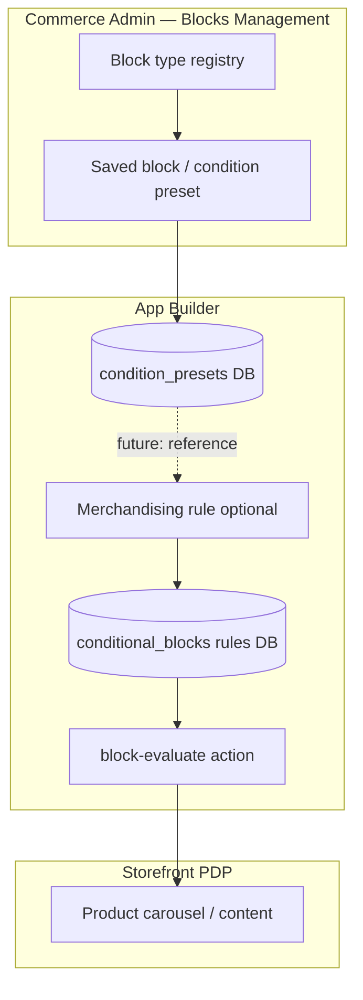

# Blocks Management — presets, rules, and placements

This document explains how the merged app models data today and how it can grow when you add more block types or CMS placements.

## Three layers (mental model)

### 1. Block type (schema)

- **What**: A template that defines which fields appear in the admin form.
- **Examples**:
  - `littlefarms_featured_recommended` → **LittleFarms: Featured/Recommended Products** (product count + conditions)
  - `littlefarms_brands_list` → **LittleFarms: Brands List** (optional view-all URL + repeatable brand rows: image, name, link)
- **Where in code**: `src/commerce-backend-ui-2/web-src/src/block-types/index.ts` and `actions/block/lib/constants.js` (`BLOCK_TYPES`).

Adding a future type means: register the type in both places and add a form module under `block-types/forms/`.

### 2. Saved block (condition preset) — what you use in Admin today

- **What**: A named configuration a merchant saves from **Blocks Management** (product count + condition tree).
- **Storage**: App Builder Database collection `condition_presets` (see `actions/block/lib/preset-store.js`).
- **API**: `block-condition-list`, `block-condition-write`.
- **Purpose**: Reusable merchandising logic — “show up to N products that match these conditions.” **Fetch SKUs** previews matches via `block-metadata` (`resource: matches`).

This is the object you create when you click **Save block** in the UI. It is **not** yet tied to a specific CMS page or Page Builder slot.

### 3. Merchandising rule (storefront rule) — optional second layer

- **What**: A richer document used on the **product detail page** to decide which blocks to show for the **product being viewed** (target SKUs, title, HTML, store view, priority, enable/disable).
- **Storage**: `conditional_blocks` collection (`actions/block/lib/rules-store.js`).
- **API**: `block-list`, `block-write`, `block-remove`, and **`block-evaluate`** for the storefront.
- **Purpose**: LS Retail–style “when the shopper views product X, show these recommendations.”

The reference architecture treats **rules** as the storefront source of truth. **Presets** are the newer admin UX for building condition logic that can later be **referenced by** or **copied into** rules.

## How they relate (v1 vs future)

| Concept | v1 (merged app) | Future option |
|--------|------------------|---------------|
| Merchant saves in Admin | **Saved block** (preset) | Same, plus pick **block type** from a dropdown |
| Storefront PDP | **Rules** + evaluate API (if configured) | Preset id on a rule, or preset → auto-sync rule |
| CMS / Page Builder slot | Not in v1 | **Placement** record: slot id + preset id + sort order |

**Placement (future)** would answer: “On homepage hero, render preset `#abc`.” That is separate from “what conditions does this block use?” (preset) and separate from “on PDP, does this product match?” (rule evaluate).

## Recommendation for your decision (item 4)

- **If you only need Admin to define and preview product sets**: treat **saved blocks (presets)** as your v1 “block.” Storefront integration can come later.
- **If you need PDP behavior like the old LS Retail module now**: also use **rules** + `block-evaluate` and wire the storefront to `docs/storefront-contract.md`.
- **If you need both**: keep presets as the editor; on save (or publish), create/update a linked **rule** with the same logic — we can add a “Publish to storefront” step in a later phase.

Tell us which path you want for the next implementation phase and we will align the UI (e.g. hide rule APIs vs expose “Publish to PDP”).
